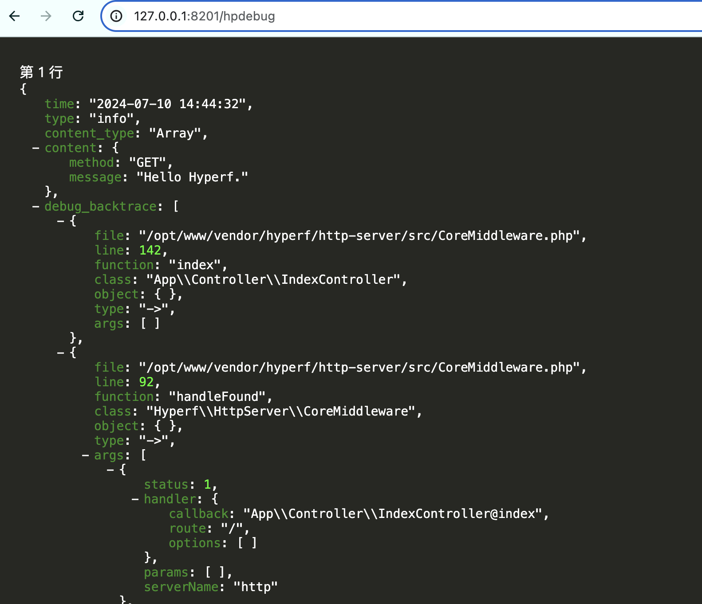

# Hyperf debug
>Debug for Hyperf

## 安装组件:
>composer require wisonlau/hyperf-debug

## 安装 WebSocket 服务:
>[详见 Hyperf 官方文档](https://doc.hyperf.io/#/zh/websocket-server)

修改 config/autoload/server.php，增加以下配置。
```php
'servers' => [
    [
        'name' => 'ws',
        'type' => Server::SERVER_WEBSOCKET,
        'host' => '0.0.0.0',
        'port' => 9502,
        'sock_type' => SWOOLE_SOCK_TCP,
        'callbacks' => [
            Event::ON_HAND_SHAKE => [Hyperf\WebSocketServer\Server::class, 'onHandShake'],
            Event::ON_MESSAGE => [Hyperf\WebSocketServer\Server::class, 'onMessage'],
            Event::ON_CLOSE => [Hyperf\WebSocketServer\Server::class, 'onClose'],
        ],
    ],
],
```

## 发布配置:
>php bin/hyperf.php vendor:publish wisonlau/hyperf-debug

## 注意事项：

- 配置文件路径：config/autoload/hpdebug.php

- 默认地址是 ws://127.0.0.1:9502, 需修改成服务实际配置地址

## 使用方法：[composer.json](..%2F..%2Fyile%2Fdnmp%2Fwww%2Fapp-api%2Fcomposer.json)
1. 通过自定义路由 Router 添加输出页面
修改 /hyperf/config/routes.php，增加以下配置。
```php
Router::addRoute(['GET', 'POST', 'HEAD'], '/hpdebug', function() {
    $wsdebug = new \Wisonlau\HyperfDebug\Hpdebug();
    $response = new \Hyperf\HttpServer\Response();
    return $response->raw($wsdebug->getHtml())->withHeader('content-type', 'text/html; charset=utf-8');
});

Router::addServer('ws', function () {
    Router::get('/', Wisonlau\HyperfDebug\Hpdebug::class);
});
```

2. Demo
```php
php>=8.0
<?php
namespace App\HttpController;

use Hyperf\Di\Annotation\Inject;
use Wisonlau\HyperfDebug\Hpdebug;

class TestController 
{
    #[Inject]
	protected Hpdebug $debug;

	public function test()
	{
		$userData = [
		    'uid' => 1,
		    'username' => 'hyperf-debug',
		];
		$this->debug->send($userData);
	}
}

php<8.0
<?php
namespace App\HttpController;

use Hyperf\Di\Annotation\Inject;
use Wisonlau\HyperfDebug\Hpdebug;

class TestController 
{
   /**
    * @Inject()
    * @var Hpdebug
    */
	protected $debug;

	public function test()
	{
		$userData = [
		    'uid' => 1,
		    'username' => 'hyperf-debug',
		];
		$this->debug->send($userData);
	}
}
```

3. 访问调试地址
http://127.0.0.1:9501/wsdebug


